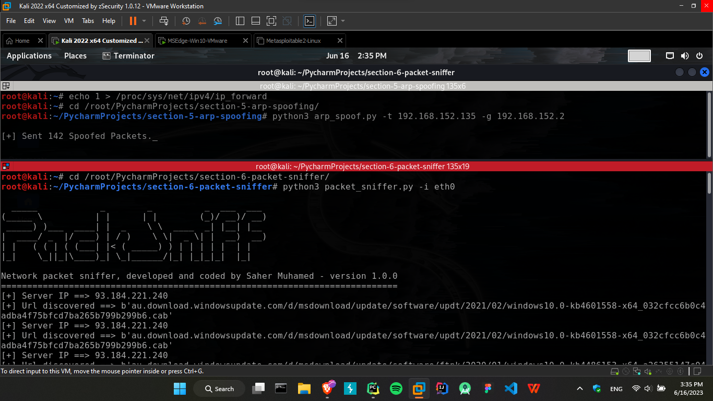
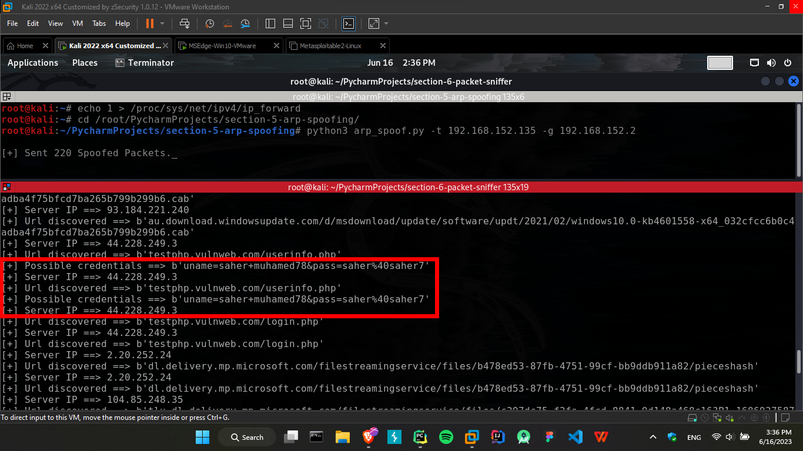
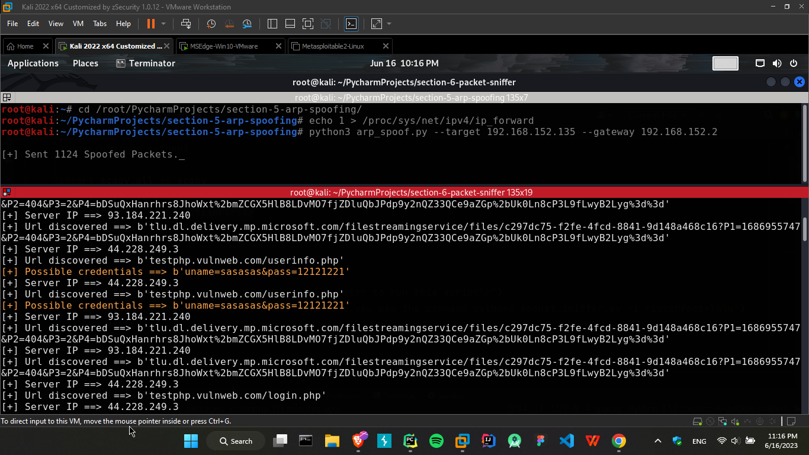

# Network Packet Sniffer

- This Python script is a network packet sniffer that captures and analyzes network packets on a specified network interface. It detects HTTP requests and searches for potential credentials within the captured packets.
- The script utilizes the scapy library for packet capturing and parsing. It specifically focuses on capturing HTTP packets and extracting useful information such as server IP, URLs, and potential credentials. The captured packets are processed in real-time, and relevant details are displayed on the console.

## Prerequisites
- Python 3.x
- `scapy` library
- `optparse` library
- `colorama` library

## Installation
- Clone the repository or download the script:
   ```commandline
   git clone https://github.com/SaherMuhamed/packet-sniffer-mitm.git
   ```
- Install the required libraries using the following command:
   ```commandline
   pip install scapy colorama
   ```


## Usage
1. Make sure you have the necessary prerequisites installed first.
2. Run the script using the following command:
    ```commandline
    python3 packet_sniffer.py -i <interface_name>
    ```
   Replace `<interface_name>` with the name of the network interface card you want to use for packet capturing. You can find the available interfaces by running `ifconfig` command in linux OS.

## Features
1. Captures network packets in real-time on a specified network interface.
2. Detects HTTP requests.
3. Searches for potential credentials within the captured packets.
4. Extracts server IP and URLs from HTTP packets.
5. Identifies potential credentials based on specific keywords in packet payload.

## Output
- The script will display the following information for each captured packet:
   1. `Server IP`: The destination IP address of the packet.
   2. `URL`: The URL extracted from the HTTP request.
   3. `Possible credentials`: If the packet payload contains any of the predefined keywords (e.g., 'uname', 'username', 'login', 'usr', 'usrname', 'pass', 'email', 'password'), it will be displayed as a potential credential. 

- Note: This script is for educational purposes only. Make sure you have proper authorization before using it on any network.

## Screenshots



## Disclaimer
This script is intended for educational and research purposes only. Please use it responsibly and in compliance with applicable laws and regulations. Iam assume no responsibility for any misuse or damages caused by this script.

## New Update!!
Now you can see `Possible credentials` field in yellow color in the console.
